# django-academic-showcase

A project by:
Marian Hristov - 2033348
Raagav Prasanna - 2036159
Guilherme Correa - 2035536

## Setting up the project

1. Clone the repo `git clone https://gitlab.com/d598/django-academic-showcase`
2. Install Postgresql 14 and run it on port 5432
3. Add Postgresql to your Windows' path (bin and lib folders)
4. Install virtualenv for python3
5. From Window's command prompt, go into the project root folder
6. Move into directory into setup folder
7. Run `setup.bat` and then `db-setup.bat`
   1. It will prompt you create a super user, please fill in ALL the information and don't forget it, even the email field.
8. To execute the server,  go back to the root folder and run `python manage.py runserver` from the virtual environment created by setup.bat
9. You're app is now running at localhost:8000 !

Extra:
For dummy data, run `python manage.py shell` from the root directory.

Run `exec(open('setup/data_creation.py').read())`

## The Project

The project will consist of four cooperating Django applications making up a website. Our project was based on the given theme which was "Academic Showcase", the items we showed were school projects. The User Management and Messaging apps were made by Raagav. The Item Catalog app was by Marian. The Website Administration app was made by Guilherme.

## The apps

### User management

#### The purpose

 The purpose of this app was to provide a login and access control feature.
- There are two types of users: guests and profiles.
- Guests can login or register and account.
- Logged in users can logout, or choose to change their password.

#### The pages of the app
  - The dashboard: 
    - Guests can login or register from here. Logged in users can logout, reset their password, or choose to view their projects, where they can also create a new project.
- The Register page:
    - Here is where accounts are created. A form is displayed where all the requested elements can be entered. Will redirect to login after creation.
- The login page:
    - Login in prompt where username and password can be entered. Login will redirect to dashboard
- The Reset password page:
    - Users are asked to type in their old password and enter as well as confirm their new desired password. They are then redirected to dashboard after changing their password.
#### Screenshots
Guest accessing dashboard: 
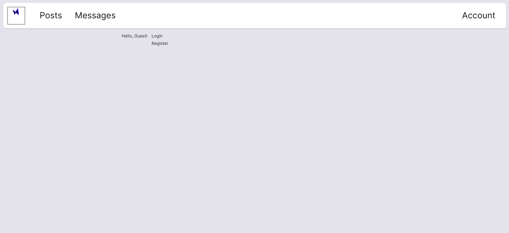
Profile accesing dashboard:
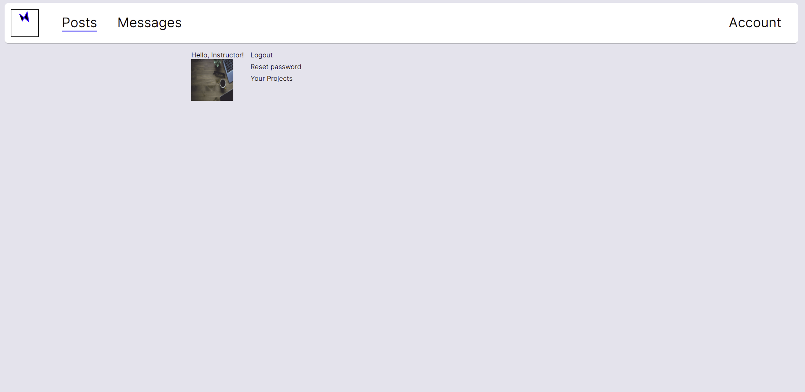
The register page:
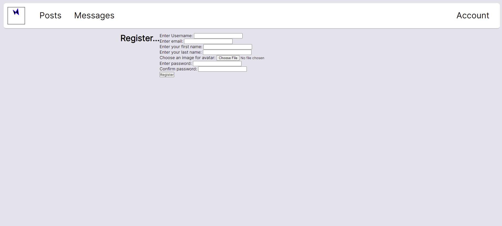
The login page:
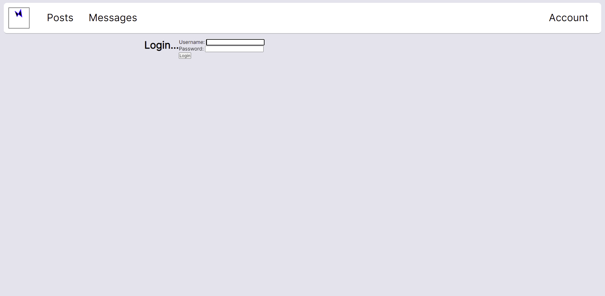
The reset password page:
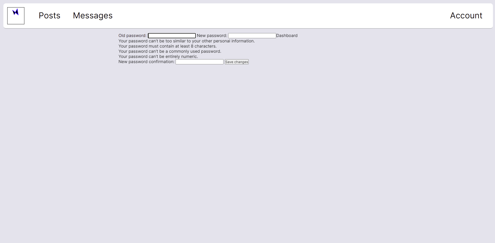
#### Considerations
If a user such a superuser is created and logged in through the admin page, they will not have a profile linked to them. Thus when accessing the dashboard, a profile will automatically be created with the default profile picture for the user. This action generally will only occur if a user is able to login via the admin dashboard, and then they choose to open the application for the first time.

---

### Messaging

#### The purpose

The purpose of this app was to provide a login and access control feature. The website has two types of users:

#### The pages of the app

#### Screenshots

Creating a new message:
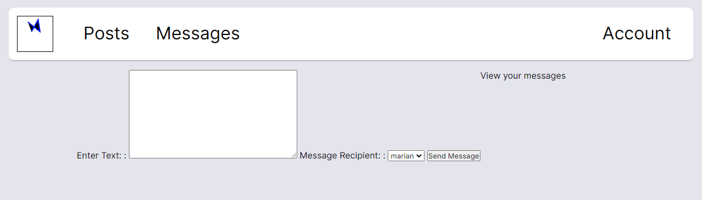
New Message notification:
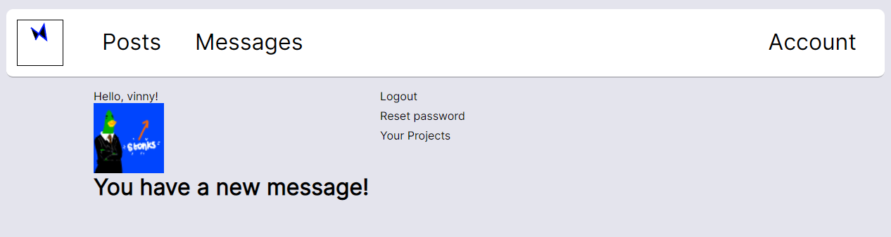
Messages, newest always at top:
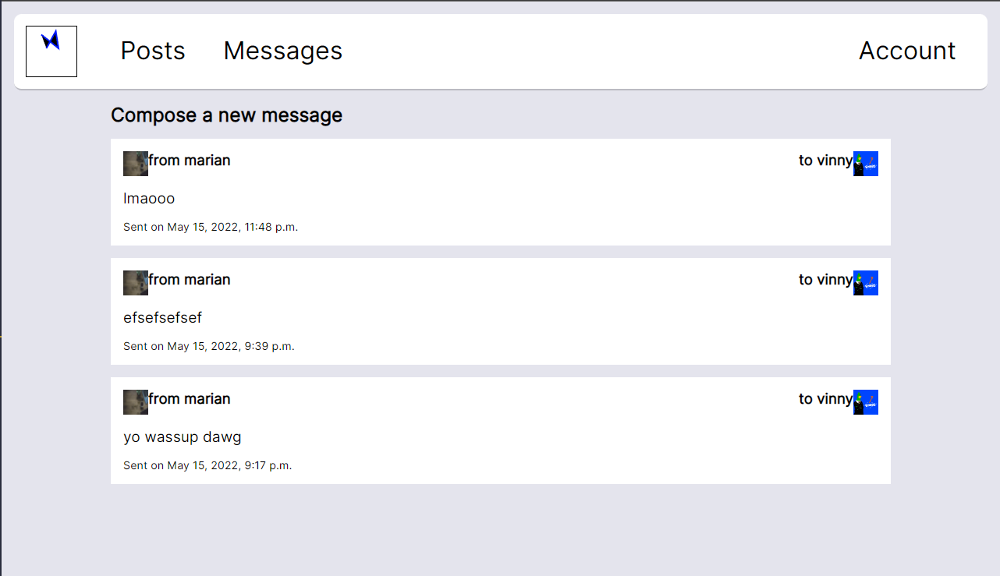

#### Considerations
- These message have nnew

---

### Item Catalog Management

#### The purpose

The purpose of this app is to display the projects of the members. Only logged in Members can see posts' details. However, Visitors can see the post normal view. 

Search and filtered is available to everyone. Searching searches through the post title, the post's project name, the post's project type, the post's project field, the post's project keywords, the post's project description and the post's project status. Filters order by ascending order and apply on the post's title, the post's project type, the post's project field and the post's project owner.

Members can create posts and projects, edit and delete them. 

Members can also comment on on posts, rate the post and even like posts. Note that once you have like a post, you can remove your like by disliking it.

#### The pages of the app

- Posts pages
    - Landing page: to view all posts
    - Create/Delete/Update pages for posts
        - Delete and update pages are available through the post's detail page
- Project pages:
    - They are available on the user's dashboard
        - Accessing that page will list all your projects by name
            - When clicking on the project, the detail view will have options for edit or delete the project 

#### Screenshots
Landing page:
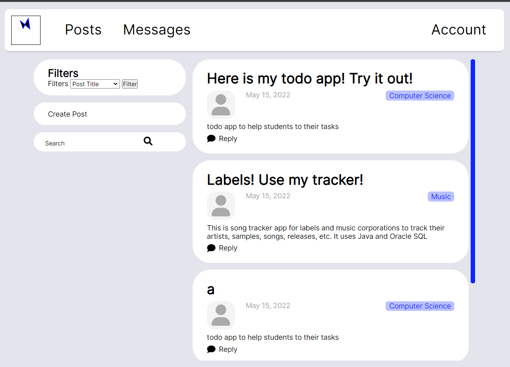
Users projects:
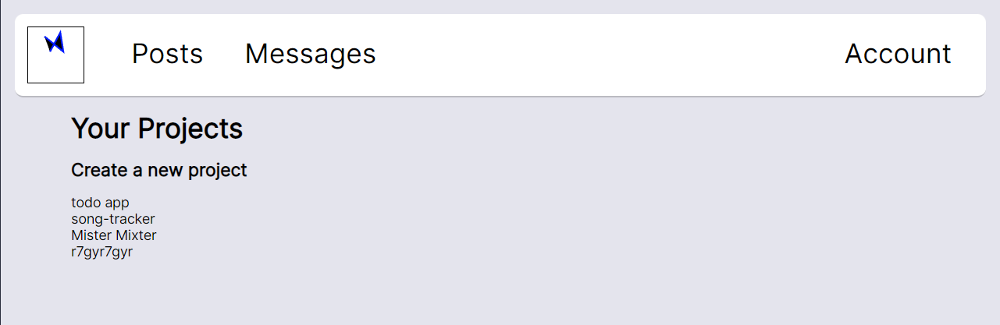
Detail view of post:
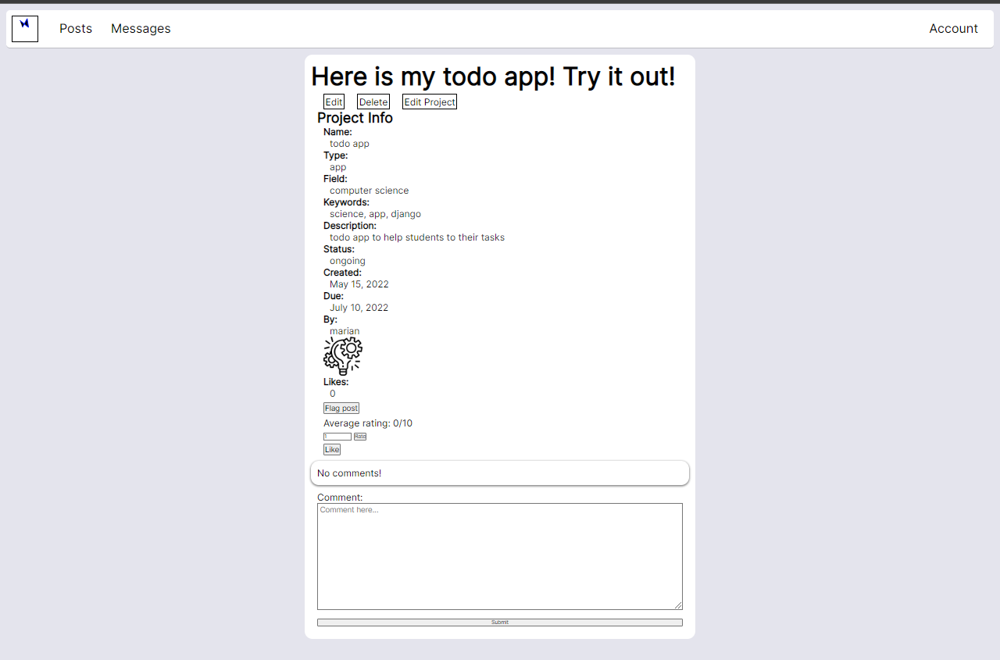
Detail view of project:
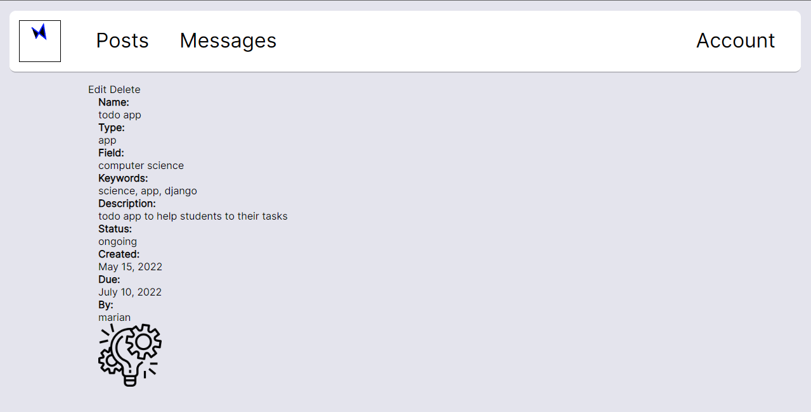
#### Considerations
- There's a button available for editing the post's project from the post's detail view
- If a project is delete, the posts of that project are deleted
- If a post is deleted, all the comments and ratings will be deleted
- If a user is deleted, all the posts, projects, comments and ratings will be deleted

---

### Website Administration

#### The purpose
- administration website (web_admin)
Used to show, add, remove and reset password of users, depending on their privileges. It also create 4 different privileges groups that is used to filter certain views.
#### The pages of the app
/web_admin/ (accessible to admins only)
- Display all the members that are under or in the same group the current user is.
- Members can have their password changed by admins, blocked or have their accounts removed
- Admins can create new members on the member page

/web_admin/flagged_posts/ (check url)
- Allow admins to list flagged posts and remove them if necessary. They can also unflag the post.

#### Screenshots

Web admin page, group management:
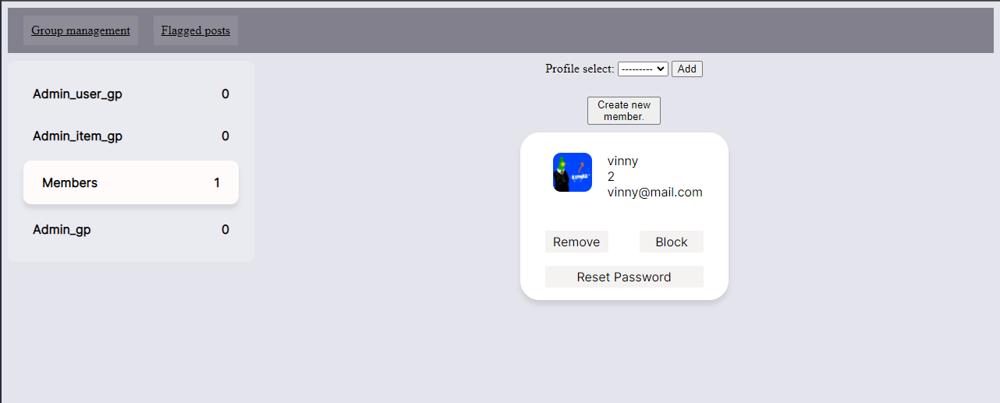
Flagged posts:
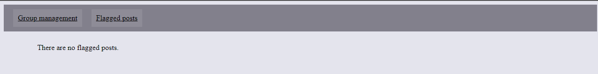

#### Considerations
- If the member is removed from its last group, they will be removed from the application. To indicate it, the "remove" button will turn red on hover.
- Only non admin can have their password changed
- The register member page uses the same user registration form but on another view.
- Members can be in multiple groups and they will inherit all their privileges.
- Only admins can access the web_admin pages 

## Important links

Heroku website: https://gitlab.com/d598/django-academic-showcase 
Gitlab repo: https://mhristov-academic-showcase-app.herokuapp.com/

## Missing features
- To access website adminitration you need to add `/web_admin/` after the url
- The projects' image doesn't work, however there is still a default image. Also, the users' custom images work just fine. 